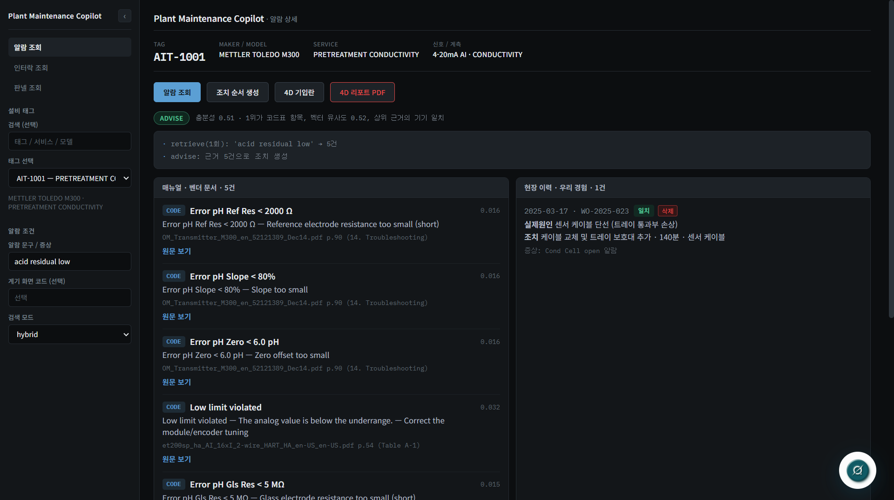
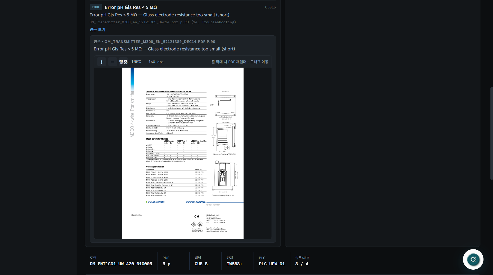
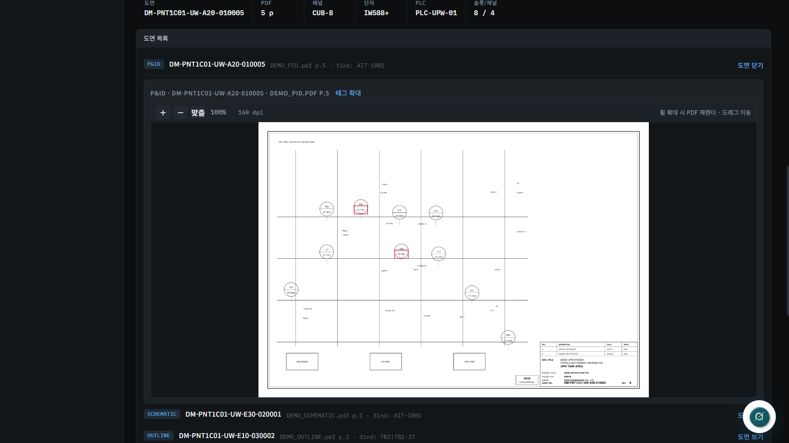
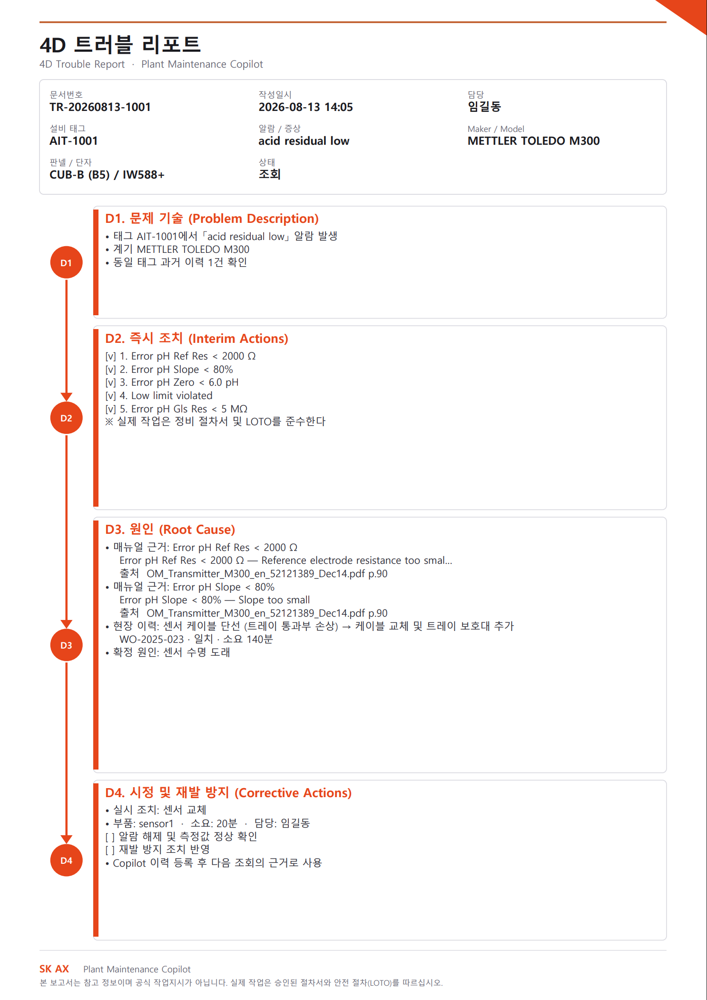

# Plant Maintenance Copilot

플랜트 계장 설비의 알람을 **문서 근거와 대조해서** 답하는 정비 보조 도구입니다.
근거를 못 찾으면 답을 지어내지 않고 거절합니다.

> 이 저장소의 자료는 **전부 생성기로 만든 가상 데이터**입니다.
> 실제 프로젝트 문서는 포함되어 있지 않습니다. → [데이터](#데이터)

---

## 왜 만들었나

현장에서 알람이 뜨면 정비 담당자는 이런 순서를 밟습니다.

1. 이 태그가 어느 판넬 어느 채널에 물려 있나 — **IO List**
2. 이 계기는 어느 회사 무슨 모델인가 — **계기 리스트**
3. 이 알람이 무슨 뜻인가 — **벤더 매뉴얼** (영문 PDF 수백 쪽)
4. 이걸 멈추면 뭐가 같이 서나 — **인터락 리스트**
5. 도면 어디에 있나 — **P&ID·배치도**

문서가 다섯 종류로 흩어져 있고 서로 태그 표기가 다릅니다.
숙련자는 머릿속으로 잇지만, 그 연결이 문서화되어 있지는 않습니다.

이 도구는 그 다섯 문서를 **태그 하나로 이어서** 보여줍니다.
그리고 답마다 **어느 문서 몇 쪽에서 나왔는지**를 함께 냅니다.

## 무엇이 다른가

**근거가 없으면 거절합니다.** 검색 결과의 충분성을 규칙으로 채점하고,
기준에 못 미치면 질의를 다시 써서 재검색합니다. 그래도 부족하면
`abstain` — "모르겠다"고 답합니다. 그럴듯한 문장을 만들어내는 것보다
못 찾았다고 말하는 편이 현장에서 안전합니다.

**LLM은 마지막 단계에만 씁니다.** 검색·판정·인터락 조회·판넬 조회는
전부 규칙과 색인으로 처리합니다. LLM은 이미 찾은 근거를 조치 순서로
정리할 때만 관여하고, 생성된 조치가 실제 근거 ID를 참조하는지 검증합니다.

**한글로 물어도 영문 매뉴얼을 찾습니다.** 수동 번역 사전 없이
다국어 임베딩(`bge-m3`)으로 붙입니다.

## 화면

<!-- TODO: 스크린샷 4장을 docs/img/ 에 넣고 아래 경로를 맞추십시오.
     1) 알람 조회 결과 + 근거 카드
     2) 근거를 눌렀을 때 매뉴얼 원문 페이지
     3) P&ID 에서 태그가 강조된 도면
     4) 4D 트러블 리포트 PDF -->

| 알람 조회 | 근거 원문 |
|---|---|
|  |  |

| 도면 태그 강조 | 4D 리포트 |
|---|---|
|  |  |

## 빠른 시작

### 필요한 것

- Python 3.10+
- [Ollama](https://ollama.com) — 임베딩과 조치 생성에 사용
- Node.js 18+ (UI를 쓸 경우)

### 설치

```bash
pip install -r requirements.txt

ollama pull bge-m3        # 임베딩 (필수)
ollama pull llama3.2      # 조치 순서 생성
```

### 실행

Ollama 서버를 먼저 띄우고, 별도 창에서 실행합니다.

```bash
ollama serve
```

```bat
run_demo.bat
```

처음 한 번은 매뉴얼 임베딩을 만드느라 몇 분 걸립니다.
`http://localhost:8000` 으로 열립니다.

UI를 개발 모드로 띄우려면:

```bash
cd ui/react
npm install
npm run dev
```

### Ollama 없이 돌리기

없어도 동작합니다. 검색이 BM25만 쓰게 되고(한글 질의 성능 저하),
조치 순서는 LLM 대신 템플릿으로 나옵니다.
알람 조회·인터락·판넬·도면·리포트는 그대로 동작합니다.

## 데이터

`demo_data/` 의 자료는 전부 `tools/` 의 생성기가 만든 가상 데이터입니다.

| 파일 | 내용 | 생성기 |
|---|---|---|
| `IO_LIST.xlsx` | 입력 76 + 출력 24 = 100점 | `tools/make_io_list.py` |
| `INSTRUMENT_LIST.xlsx` | 계기 사양 100건 | `tools/make_io_list.py` |
| `TB_LIST.xlsx` | 판넬 6 · TB 블록 36 | `tools/make_tb_list.py` |
| `interlock/` | 인터락 33건 / 조건 92행 | `tools/make_interlock_list.py` |
| `drawings/` | P&ID · 배치도 · 외형도 · 결선도 | 합성 도면 |
| `manuals/` | 벤더 카탈로그 3종 | 제조사 공개 자료 |

자기 자료로 바꾸려면 `COPILOT_DATA_DIR` 로 폴더를 지정하십시오.
색인과 파생물도 세트마다 갈립니다.

```bat
set COPILOT_DATA_DIR=%CD%\my_data
set COPILOT_INDEX_DIR=%CD%\my_index
set COPILOT_DERIVED_DIR=%CD%\my_derived
```

## 검증

자료를 바꿔 끼울 때마다 평가셋을 다시 만들고 점검합니다.

```bash
python -m eval.make_eval_interlock
python -m eval.make_eval_panel
python -m eval.selfcheck
```

`demo_data` 기준 현재 결과입니다.

| 항목 | 결과 |
|---|---|
| 인터락 조회 (층 분리·역방향·부재 판정·원문 보존) | 65/65 |
| 판넬 조회 (위치·카드·채널·상실 영향) | 212/212 |
| 매뉴얼 색인 | 198청크 |

`selfcheck` 는 단순 통과 검사가 아니라 **고장 주입** 검사입니다.
태그를 몰래 바꿔치기하거나 파일을 지운 상태를 만들어, 도구가 그것을
알아채는지 확인합니다. 알아채지 못하면 실패로 처리합니다.

## 구조

```
config.py            모든 경로·모델·하이퍼파라미터
ingest/              문서 읽기 — IO/계기/TB/인터락 리스트, 매뉴얼 청킹
retrieval/           BM25 · 임베딩 · RRF 융합 · 리랭커 · 인터락/판넬 색인
graph/               검색 → 채점 → 재질의 → 조치 (LangGraph)
api/                 FastAPI 서버, 4D 리포트 PDF
ui/react/            React 화면
eval/                평가셋 생성·채점, 고장 주입 자체점검
tools/               데모 자료 생성기
demo_data/           가상 자료 (이 저장소에 포함)
```

자세한 설계 배경은 [docs/ARCHITECTURE_NOTES.md](docs/ARCHITECTURE_NOTES.md) 에 있습니다.

## 한계

- 도면 태그 검색은 PDF에 텍스트 레이어가 있어야 합니다. 스캔 도면은 인식하지 못합니다.
- 조치 순서 생성 품질은 붙이는 LLM 크기에 좌우됩니다. 3B 모델에서는 문장이 거칠어집니다.
- 계기 리스트에 사양이 없는 태그(상태 접점 등)는 벤더 매뉴얼을 특정하지 못합니다.
- 인터락 리스트의 양식이 프로젝트마다 달라, 파서가 모든 양식을 다루지는 못합니다.

## 라이선스

미정.
